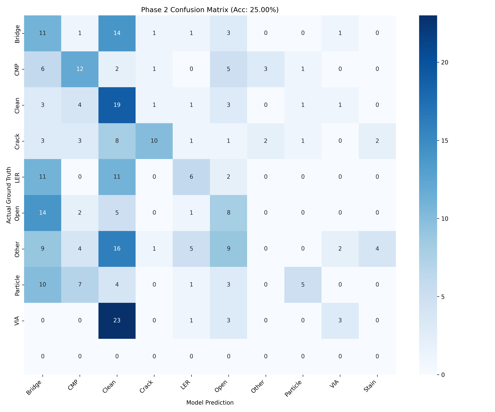

# 🔬🧠 Edge-AI Wafer Defect Classification — Phase 2 (ONNX Inference)

---

# 📌 Phase 2 Overview

Phase 2 evaluates the exported ONNX model on the provided hackathon test dataset.

This stage validates:

• ONNX inference pipeline  
• Preprocessing consistency  
• Class index alignment  
• Multi-class evaluation metrics  
• Confusion matrix generation  

---

# 🧠 ONNX Inference Pipeline

Test Dataset Image
│
▼
Resize → 224×224
│
▼
Grayscale (1 Channel)
│
▼
NHWC Conversion
│
▼
ONNX Runtime Inference
│
▼
Defect Class Prediction

---

# 🧬 Test Dataset Classes (Phase 2)

The provided test dataset contains 9 classes:

• Bridge  
• Clean  
• cmp  
• Cracks  
• LER  
• open  
• other  
• particle contamination  
• via  

⚠ Note: The "Stain" class is not present in the Phase 2 test dataset.

Evaluation was performed strictly on the available classes.

---

# 📊 Phase 2 Test Results

**Test Samples:** 296  

## 🎯 Overall Performance

| Metric | Score |
|--------|-------|
| Accuracy | ~25% |
| Micro F1 | ~0.25 |
| Macro F1 | ~0.25 |
| Weighted F1 | ~0.23 |

---

## 📈 Per-Class Performance Snapshot

| Class | F1 Score |
|--------|----------|
| Bridge | 0.22 |
| CMP | 0.38 |
| Clean | 0.28 |
| Crack | 0.44 |
| LER | 0.26 |
| Open | 0.24 |
| Other | 0.00 |
| Particle | 0.26 |
| VIA | 0.16 |

---

# 🔍 Observations

✔ Performance above random baseline (~11% for 9 classes)  
✔ Stronger predictions in CMP and Crack  
✔ Low recall observed for "Other"  
✔ Class overlap between crack/open/bridge patterns  
✔ Realistic multi-class classification challenge  

---

# 📊 Confusion Matrix

Generated using ONNX Runtime inference:

Highlights:

• Diagonal dominance in certain classes  
• Misclassification concentrated in similar defect types  
• “Other” class shows significant confusion  

---

# ⚙ Technical Details

| Component | Used |
|------------|------|
| Inference Engine | ONNX Runtime |
| Input Shape | (224,224,1) |
| Data Format | NHWC |
| Training Framework | TensorFlow + Keras |
| Backbone | MobileNetV2 |
| Batch Size | 32 |

---

# 📦 Edge Deployment Status

✔ ONNX export successful  
✔ CPU inference supported  
✔ Edge-ready format  
✔ Lightweight deployment footprint  

| Artifact | Size |
|----------|------|
| Keras Model | 26 MB |
| ONNX Model | 9 MB |

---

# 📁 Repository Structure

edge-ai-wafer-defect-classifier/
│
├── README.md
├── requirements.txt
│
├── Scripts/
│ ├── hackathon_test_dataset_prediction.py
│ ├── train.py
│ └── convert_savedmodel_onnx.py
│
├── models/
│ └── final_model.onnx
│
├── Test_Results/
│ ├── phase2_confusion_matrix.png
│ └── prediction_log.txt

---

# ▶️ Run Phase 2 Evaluation

Install dependencies:

pip install -r requirements.txt

Run inference:

python hackathon_test_dataset_prediction.py

Outputs generated:

• prediction_log.txt  
• phase2_confusion_matrix.png  

---

# 🚀 Conclusion

The ONNX inference pipeline was successfully validated under Phase 2 conditions.

• Multi-class defect detection confirmed  
• Edge-compatible deployment achieved  
• Evaluation metrics computed under real dataset constraints  

The system is ready for further optimization, retraining, or hardware deployment.

---

If helpful, consider giving this repository a ⭐
